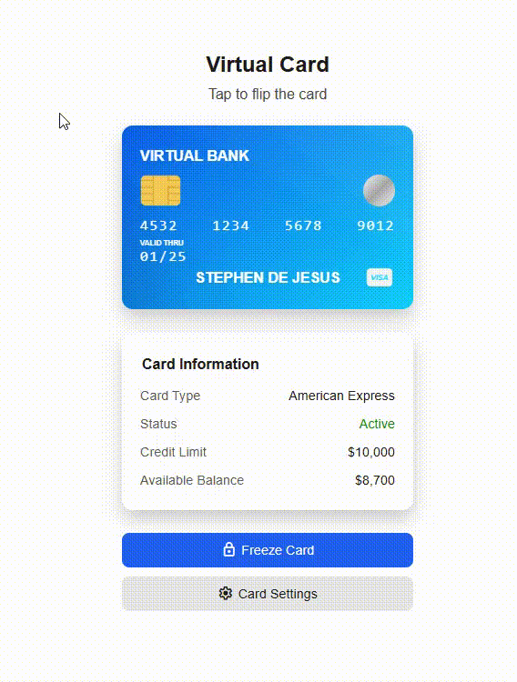

# 💳 Virtual Bank Card
A sleek, interactive, and accessible **Virtual Bank Card UI** built using **HTML** and **CSS**.  
Designed by **Stephen William G. De Jesus**, this component features a realistic 3D flip animation, card details display, and action buttons — perfect for banking apps, fintech dashboards, or financial service websites.

---

## 📸 Preview


---

## 🌐 Live Demo
[View Live Demo](https://bogiiiie.github.io/virtual-bank-card/)

---

## 📁 Features
✅ Interactive 3D card flip animation on hover  
✅ Realistic card design with EMV chip and hologram  
✅ Card details table with hover effects  
✅ Freeze card and settings action buttons  
✅ Material Symbols icons integration  
✅ Responsive design for mobile and desktop  
✅ ARIA labels and semantic HTML for accessibility  
✅ Modern UI with smooth CSS transitions

---

## 🛠️ Built With
- **HTML5** – for semantic and accessible structure  
- **CSS3** – for 3D transforms, animations, and responsive layout  
- **Google Fonts** – for Montserrat typography  
- **Material Symbols** – for action button icons

---

## 🚀 Getting Started
To view or edit the project locally:

1. Clone the repo:
   ```bash
   git clone https://github.com/YOUR_USERNAME/virtual-bank-card.git
   ```

2. Navigate to the project directory:
   ```bash
   cd virtual-bank-card
   ```

3. Open `index.html` in your browser:
   ```bash
   open index.html
   ```

4. **Required assets:** Make sure you have these files in the `images/` folder:
   - `chip.png` – EMV chip graphic
   - `Shiny Overlay.svg` – Card background overlay

---

## 🎨 Customization
### Card Information
Edit the HTML to customize card details:
```html
<!-- Card Number -->
<div class="card-number numeral">
    <span>4532</span>
    <span>1234</span>
    <span>5678</span>
    <span>9012</span>
</div>

<!-- Cardholder Name -->
<div class="cardholder-name">Your Name Here</div>
```

### Theme Colors
Modify CSS custom properties to change the theme:
```css
:root {
  --color-text-primary: rgb(30, 28, 28);
  --color-button-primary: rgb(24, 98, 246);
  --color-background-light: rgb(243, 243, 243);
}
```

---

## 📱 Browser Support
- ✅ Chrome 60+
- ✅ Firefox 55+  
- ✅ Safari 12+
- ✅ Edge 79+

---

## 🤝 Contributing
Contributions are welcome! Feel free to:
- 🐛 Report bugs
- 💡 Suggest new features
- 🔧 Submit pull requests

---

## 📄 License
This project is open source and available under the [MIT License](LICENSE).

---

## 👨‍💻 Author
**Stephen William G. De Jesus**

---

⭐ **Star this repo** if you found it helpful!
